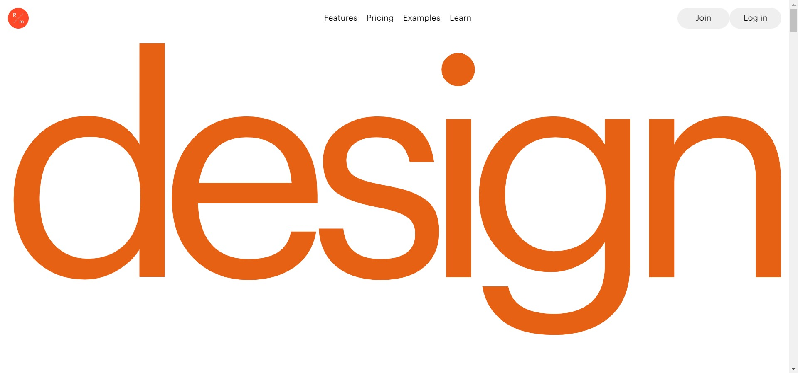

<div id="top"></div>

<br />
<div align="center">
  <h1 align="center">Readymag Landing Page</h1>

  <p align="center">
    Clone of the readymag landing page.
  </p>
</div>

## About The Project



I created landing page clone of readymag website using html, css and javascript.

Here's why:

- It gives me good understanding about how css works in html.
- I also learn how to use amazing animation library GSAP (3.5.1)

it is better starting project for new web developer

## Demo

Here is a quick demo of the app. I hope you enjoy it.

> [The Demo Link](https://naim30.github.io/readymag-landing-page/)

## Built With

To build this Landing page I used..

- HTML
- CSS
- JAVASCRIPT
- [GSAP (3.5.1)](https://greensock.com/gsap/)
- [ScrollTrigger (3.5.1)](https://greensock.com/scrolltrigger/)

## Getting Started

you do not need any prerequisites for this project just clone the repo and open `index.html` in browser.

Clone the repo

```sh
git clone https://github.com/naim30/readymag-landing-page.git
```

## Contact

Naimish Lukhi :
Email - lukhinaimish@gmail.com : [LinkedIn](https://www.linkedin.com/in/lukhi-naimish/) : [Twitter](https://twitter.com/naimish_30)

<p align="right">(<a href="#top">back to top</a>)</p>
